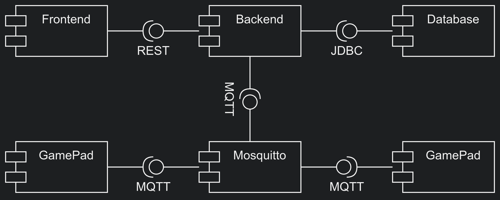

# Quiz Arena

**A real-time multiplayer quiz platform that connects web players, ESP32 gamepads, RFID authentication, and a reactive Java backend.**

Quiz Arena was developed as a two-person academic project during the 2025/2026 winter semester. Players join a shared lobby, choose a web or hardware controller, and compete in synchronized quiz rounds. The system supports up to five human players, optional bots, category selection, multiple game lengths, and persistent high scores.

> Portfolio edition: the original school infrastructure and credentials have been removed. The repository now runs entirely with local, configurable services.

## Highlights

- Real-time game state and controller events over MQTT
- Responsive browser interface plus a dedicated web gamepad
- ESP32 controller with OLED, RFID reader, buttons, and NeoPixel feedback
- Password and RFID-based player authentication with JWT
- Five-player lobbies, bots, timed rounds, scoring, and high-score tables
- Docker Compose environment for the frontend, backend, MQTT broker, database, and phpMyAdmin
- Seeded quiz content across programming, databases, web, networking, security, algorithms, operating systems, and embedded systems

## Architecture



| Layer | Technology | Responsibility |
| --- | --- | --- |
| Player UI | HTML, CSS, JavaScript, NGINX | Account, lobby, game, and high-score views |
| Controllers | Browser and ESP32/Arduino | Player input, RFID scans, and device feedback |
| Backend | Java 21, Vert.x | REST API, game rules, authentication, and orchestration |
| Messaging | Eclipse Mosquitto, MQTT | Low-latency game and controller events |
| Persistence | MariaDB | Players, questions, categories, games, and scores |
| Runtime | Docker Compose | Reproducible local multi-service environment |

The browser uses REST for account, lobby, and data operations. MQTT carries time-sensitive events between the backend and the web or hardware controllers. MariaDB stores the durable game state and seeded quiz catalogue.

## Run locally

### Requirements

- Docker Desktop or Docker Engine with Docker Compose
- Git

### Setup

```bash
git clone https://github.com/pc-mt/quiz-arena.git
cd quiz-arena
cp .env.example .env
```

Replace every `change-me-*` value in `.env`, then start the stack:

```bash
docker compose up --build
```

Open the following services:

| Service | URL |
| --- | --- |
| Quiz Arena | http://localhost |
| Web controller | http://localhost:81 |
| Backend API | http://localhost:8080 |
| phpMyAdmin | http://localhost:8081 |

Stop the application with:

```bash
docker compose down
```

To remove the local database volume as well, use `docker compose down --volumes`.

## Hardware controller

The optional ESP32 controller uses PlatformIO and communicates with the local MQTT broker.

1. Copy `arduino/include/secrets.example.h` to `arduino/include/secrets.h`.
2. Enter the Wi-Fi and MQTT settings in the copied file.
3. Review the [wiring diagram](doc/arduino_wiring.png).
4. Build and flash the firmware from the `arduino/` directory with PlatformIO.

The real `secrets.h` file is ignored by Git.

## Documentation

- [Architecture and game flow](docs/architecture.md)
- [HTTP API](docs/http-api.md)
- [MQTT topics and payloads](docs/mqtt-topics.md)
- [Database schema](docs/database.md)
- [Deployment notes](docs/deployment.md)
- [Project description — English](doc/ProjectDescription.md)
- [Project description — German](doc/ProjektBeschreibung.md)

## Repository structure

```text
quiz-arena/
├── arduino/          ESP32 firmware and hardware drivers
├── frontend/         Main browser application
├── web-controller/   Browser-based gamepad
├── java-backend/     Vert.x REST and MQTT backend
├── mariadb/          Schema and seed data
├── mosquitto/        Local MQTT broker configuration
├── docs/             Technical reference documentation
└── docker-compose.yml
```

## Security notes

- No production or school credentials belong in this repository.
- `.env` and `arduino/include/secrets.h` are intentionally ignored.
- The sample credentials are placeholders for local development only.
- Browser MQTT credentials are visible to clients by design; use a restricted local account and appropriate ACLs before any public deployment.

## Authors

Built by **Priscille C. Moumani** and **Junior Kana** as an academic team project.

This repository is presented as a portfolio project. No license is granted unless a license file is added by the authors.